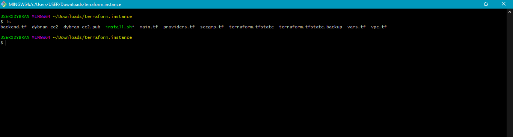
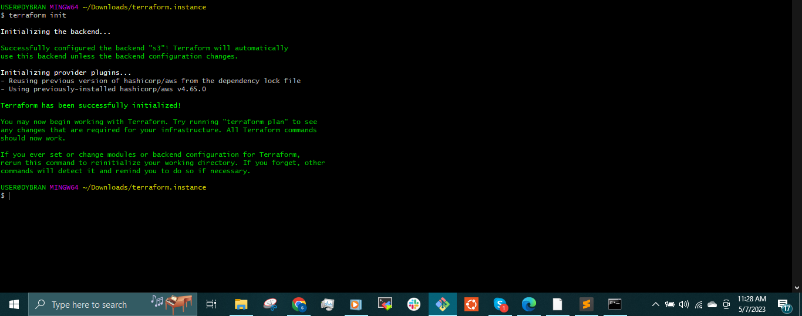

## __CREATING MULTIPLE RESOURCES AND PROVISIONING EC2 INSTANCE USING TERRAFORM__

The advancement of cloud computing has gone hand in hand with transformational technologies that aim to boost the efficiency and speed of deploying and managing resources. One of these technologies is Infrastructure as Code (IaC).

IaC is the practice of deploying, managing, and provisioning resources using configuration files instead of using interactive graphical tools or manual hardware configuration. Simply put, it is the management of your infrastructure using code that provides a blueprint for the desired state of the resources.

Before IaC, operation teams would manually make configuration changes to their infrastructure, which was a tedious and time-consuming task often associated with inconsistencies and errors.

IaC provides consistency and error reduction in the deployment and management of resources. In addition, it increases the speed of deployment, eliminates configuration drift, and reduces the costs that come with manual deployment.

One of the most popular IaC utilities is __Terraform__. Developed by HashiCorp, Terraform is an open source IaC utility that uses a __declarative configuration language__ known as HashiCorp Configuration Language (HCL) to manage or deploy hundreds of cloud resources.

In this project, we will use Terraform to create multiple resources and provision an Ec2 instance.

Prerequisites:

- AWS account;
- AWS Identify and Access Management (IAM) credentials and programmatic access. The IAM credentials that you need for EC2 can be found here;
- setting up AWS credentials locally with aws configure in the AWS Command Line Interface (CLI). Click [here](https://github.com/dybran/AWS-Lift-and-Shift-Project/blob/main/AWS-Lift-and-Shift-Project.md).

 ### __EXERCISE:__

We will be doing the following tasks: -

- Generate keypair
- write __vpc.tf__ file
  - Create VPC
  - Create 6 subnets (3 public and 3 private)
- Create security group
- Create S3 bucket for the __terraformstate.tf__ file.
- Write a bash script
- Write __backend.tf__ file
- Write __providers.tf__ file
- write __vars.tf__ file
- write __main.tf__ file
- write __secgrp.tf__ file
  - key pair resource
  - aws resource
  - __provisioners__
    - file
    - remote_exec

__GENERATING KEYPAIR__

Create a directory __terraform.instance__

`$ mkdir terraform.instance`

`$ cd terraform.instance`

Generate the keypair __dybran-ec2__

`$ ssh-keygen`


create the files

`$ touch providers.tf vars.tf main.tf vpc.tf secgrp.tf backend.tf`



Create a script to provision the instance using a template from [tooplate](www.tooplate.com).

```
#!/bin/bash

# installing packages
yum install wget unzip httpd -y

#start and enable apache
systemctl start httpd
systemctl enable httpd

#download artifact from tooplate
wget https://www.tooplate.com/zip-templates/2124_vertex.zip

#unzip and copy artifacts to /var/www/html
unzip -o 2124_vertex.zip
cp -r 2124_vertex/* /var/www/html

#restart apache
systemctl restart httpd
```


Open the __vpc.tf__ and add the following code snippet

```
resource "aws_vpc" "dybran" {
  cidr_block           = "10.0.0.0/16"
  instance_tenancy     = "default"
  enable_dns_support   = "true"
  enable_dns_hostnames = "true"
  tags = {
    Name = "Dybran"
  }
}

resource "aws_subnet" "dybran-pub-1" {
  vpc_id                  = aws_vpc.dybran.id
  cidr_block              = "10.0.1.0/24"
  map_public_ip_on_launch = "true"
  availability_zone       = var.ZONE1
  tags = {
    Name = "dybran-pub-1"
  }
}

resource "aws_subnet" "dybran-pub-2" {
  vpc_id                  = aws_vpc.dybran.id
  cidr_block              = "10.0.2.0/24"
  map_public_ip_on_launch = "true"
  availability_zone       = var.ZONE2
  tags = {
    Name = "dybran-pub-2"
  }
}

resource "aws_subnet" "dybran-pub-3" {
  vpc_id                  = aws_vpc.dybran.id
  cidr_block              = "10.0.3.0/24"
  map_public_ip_on_launch = "true"
  availability_zone       = var.ZONE3
  tags = {
    Name = "dybran-pub-3"
  }
}

resource "aws_subnet" "dybran-priv-1" {
  vpc_id                  = aws_vpc.dybran.id
  cidr_block              = "10.0.4.0/24"
  map_public_ip_on_launch = "false"
  availability_zone       = var.ZONE1
  tags = {
    Name = "dybran-priv-1"
  }
}

resource "aws_subnet" "dybran-priv-2" {
  vpc_id                  = aws_vpc.dybran.id
  cidr_block              = "10.0.5.0/24"
  map_public_ip_on_launch = "false"
  availability_zone       = var.ZONE2
  tags = {
    Name = "dybran-priv-2"
  }
}

resource "aws_subnet" "dybran-priv-3" {
  vpc_id                  = aws_vpc.dybran.id
  cidr_block              = "10.0.6.0/24"
  map_public_ip_on_launch = "false"
  availability_zone       = var.ZONE3
  tags = {
    Name = "dybran-priv-3"
  }
}

resource "aws_internet_gateway" "dybran-IGw" {
  vpc_id = aws_vpc.dybran.id
  tags = {
    Name = "dybran-IGw"
  }
}

resource "aws_route_table" "dybran-pub-RT" {
  vpc_id = aws_vpc.dybran.id
  route {
    cidr_block = "0.0.0.0/0"
    gateway_id = aws_internet_gateway.dybran-IGw.id
  }

  tags = {
    Name = "dybran-pub-RT"
  }
}

resource "aws_route_table_association" "dybran-pub-1-a" {
  subnet_id      = aws_subnet.dybran-pub-1.id
  route_table_id = aws_route_table.dybran-pub-RT.id
}

resource "aws_route_table_association" "dybran-pub-2-b" {
  subnet_id      = aws_subnet.dybran-pub-2.id
  route_table_id = aws_route_table.dybran-pub-RT.id
}

resource "aws_route_table_association" "dybran-pub-3-c" {
  subnet_id      = aws_subnet.dybran-pub-3.id
  route_table_id = aws_route_table.dybran-pub-RT.id
}
```

The above code will be creating the VPC, 6 subnets (3 private and 3 public subnets), internet gateway and Route table(which will be associating the public subnets to the internet gateway).

Open __secgrp.tf__ and add the code snippet. This will create the security group

```
resource "aws_security_group" "dybran-sg" {
  name        = "dybran-prj-sg"
  description = "sec group for dybran ssh"
  vpc_id      = aws_vpc.dybran.id

  ingress {
    from_port   = 22
    to_port     = 22
    protocol    = "tcp"
    cidr_blocks = [var.MYIP]
  }

  egress {
    from_port   = 0
    to_port     = 0
    protocol    = "-1"
    cidr_blocks = ["0.0.0.0/0"]
  }

  tags = {
    Name = "dybran-prj-sg"
  }
}
```
Open the __vars.tf__ file and paste the code snippet. The __vars.tf__ file contains the variables.

```
variable REGION {
  default = "us-east-1"
}

variable ZONE1 {
  default = "us-east-1a"
}

variable ZONE2 {
  default = "us-east-1b"
}

variable ZONE3 {
  default = "us-east-1c"
}

variable AMIS {
  type = map(any)
  default = {
    us-east-1 = "ami-03951dc3553ee499f"
    us-east-2 = "ami-06ad5df4b191f59d0"
  }
}

variable USER {
  default = "ec2-user"
}

variable PUB_KEY {
  default = "dybran-ec2.pub"
}

variable PRIV_KEY {
  default = "dybran-ec2"
}

variable MYIP {
    default = "192.168.56.1/32"
}

```
When working in a team where we use the same codes, we will have different __terraformstate.tf__ files.
We need the state to be in sync(should be the same across all execution). One of the methods to maintain the terraform infrastructure state remotely is by pushing __terraformstate.tf__ file to an S3 bucket.

Create an S3 bucket - __dybran__


Create a folder inside the bucket - __Dybran-terrastate__


Open the __backend.tf__ file and paste the code snippet

```
terraform {
	backend "s3" {
	bucket = "dybran"
	key = "Dybran-terrastate/backend_s3"
	region = "us-east-1"
	}
}

```

Open the __providers.tf__ file and paste the code snippet

```
provider "aws" {
    region = var.REGION
}

```


Where __REGION__ is a variable name in the __vars.tf__ file.

Open the __main.tf__ file and paste the code snippet

```
resource "aws_key_pair" "dybran-key" {
  key_name   = "dybran-ec2"
  public_key = file(var.PUB_KEY)
}

resource "aws_instance" "dybran-instance" {
  ami                    = var.AMIS[var.REGION]
  instance_type          = "t2.micro"
  availability_zone      = var.ZONE1
  key_name               = aws_key_pair.dybran-key.key_name
  subnet_id              = aws_subnet.dybran-pub-1.id
  vpc_security_group_ids = [aws_security_group.dybran-sg.id]
  tags = {
    Name    = "Dybran"
    Project = "Project-Dybran"
  }

  provisioner "file" {
    source      = "install.sh"
    destination = "/tmp/install.sh"
  }

  provisioner "remote-exec" {
    inline = [
      "chmod u+x /tmp/install.sh",
      "sudo /tmp/install.sh"
    ]
  }

  connection {
    user        = var.USER
    private_key = file(var.PRIV_KEY)
    host        = self.public_ip
  }
}

resource "aws_ebs_volume" "vol-dybran" {
  availability_zone = var.ZONE1
  size              = 3
  tags = {
    Name = "dybran-extra-vol"
  }
}

resource "aws_volume_attachment" "attach-vol-dybran" {
  device_name = "/dev/xvdh"
  volume_id   = aws_ebs_volume.vol-dybran.id
  instance_id = aws_instance.dybran-instance.id
}

output "PublicIP" {
  value = aws_instance.dybran-instance.public_ip
}
```

The __main.tf__ file creates the resources for the project which include the keypair, instance and EBS volume. The __main.tf__ will access the __providers.tf__ file which accesses the __vars.tf__ file to create the resources, copy the __install.sh__ script to the instance which will be used to provision the instance. The __connection__ details will be used to access the instance.

To run this, we need to run the terraform commands

`$ terraform init`

To install the AWS Plugins needed to run terraform on AWS.



`$ terraform validate`

To validate the syntax in the files.


`$ terraform fmt`

To format the codes in the files for easy readability.

`$ terraform plan`

To to display the series of actions terraform is going to take.


`$ terraform apply`

To create the resources and provision the instance.


__N/B:__ the Public IP is displayed.

The resources are created and the instance is provisioned after sometime.

Internet gateway


VPC and subnets


Route table


EBS Volume


Associated route table to subnets


Security group


Instance


The __terraformstate.tf__ file in the S3 bucket can be downloaded to your local machine.


We can access the instance using the public IP address. Make sure to open port __80__ on the security group.


We have successfully created multi resources and provisioned an Ec2 instance.


We can terminate the instance by running

`$ terraform destroy`


The instance is terminated


Continue on [project-16](https://github.com/dybran/Project-13/blob/main/project-16.md) 
